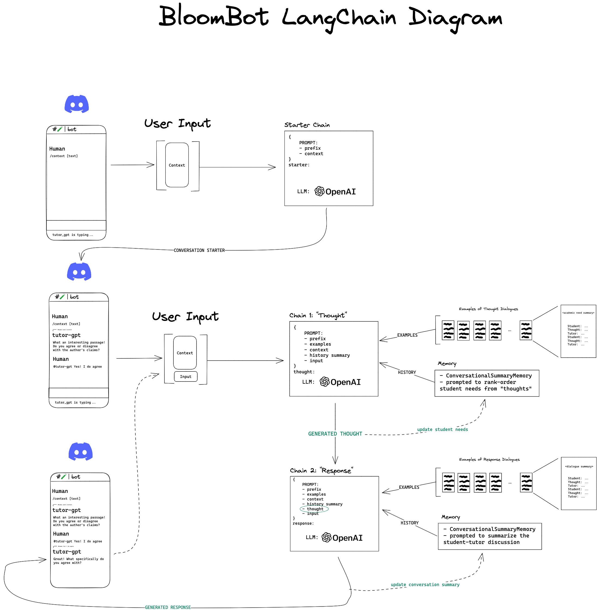

# tutor-gpt
LangChain LLM application. Dynamic few-shot prompting for the task of tutoring. 



## Installation

This project requires docker to be installed and running locally. [Install docker](https://docs.docker.com/get-docker/) and ensure it's running before proceeding.

## Getting Started

This app requires you to have a few different environment variables set. Create a `.env` file from the `.env.template`.

**OPENAI_API_KEY**: Go to [OpenAI](https://beta.openai.com/account/api-keys) to generate your own API key.  
**BOT_TOKEN**: This is the discord bot token. You can find instructions on how to create a bot and generate a token in the [pycord docs](https://guide.pycord.dev/getting-started/creating-your-first-bot).  
**THOUGHT_CHANNEL_ID**: This is the discord channel for the bot to output thoughts to. Make a channel in your server and copy the ID by right clicking the channel and copying the link. The channel ID is the last string of numbers in the link.  

## Docker/Containerization

The repository containers a `Dockerfile` for running the bot in a containerized workflow. Use the follow command to build and run the container

```bash
docker build -t tutor-gpt:latest .
docker run tutor-gpt:latest 
```

The current behaviour will utilize the `.env` file in your local repository and run the bot.